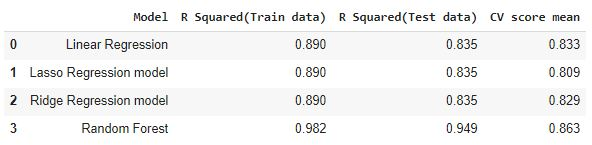

# Car Price Prediction
This project aims to predict the Price of an used car by taking it's, year of production, driven km, fuel type, seller type, owner and transmission type.
This Project uses Machine Learning Models such as: Linear Regression, Laso Regression model, Ridge Regression model, Random Forest to predict the value of and old used car.

## Data

Dataset is used from kaggle. [Data](https://www.kaggle.com/datasets/nehalbirla/vehicle-dataset-from-cardekho) 
The columns in the given dataset are as follows:

* name
* year
* selling_price
* km_driven
* fuel
* seller_type
* transmission
* Owner
